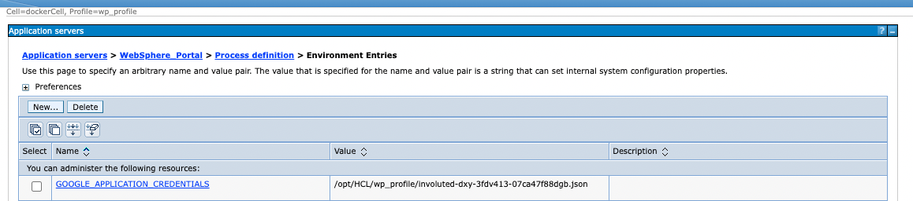

# hcl-dx-google-vertex-sample


Combined with:


Built with:


This project contains the source code and build for a sample AI integration for DX for WCM following the model established in https://opensource.hcltechsw.com/digital-experience/latest/get_started/plan_deployment/container_deployment/wcm_content_ai_analysis.html?h=analysis#configuring-ai-class-for-custom-content-ai-provider.

It leverages Google Vertex AI for sentiment analysis, summary and keyword generation.

The build of the project is established via maven.

## Code Adjustment

Adjust the following for your project and region:
```
	private static final String PROJECT = "your-project-id-google";
	private static final String LOCATION = "us-central1";
```

## Deployment

Use mvn package and copy the resulting jar file to the DX shared library - e.g. on a container to /opt/HCL/wp_profile/PortalServer/sharedLibrary.
Also include any required jar files - e.g. for the google maven dependency. 
Not sure how to get those? A command like mvn dependency:copy-dependencies will download all the dependent jar files to the target/dependency directory.


Generate a service account key and export the key to DX.


Configure a WAS environment variable with defined service account 



Follow the steps for https://opensource.hcltechsw.com/digital-experience/latest/get_started/plan_deployment/container_deployment/wcm_content_ai_analysis.html?h=analysis#configuring-ai-class-for-custom-content-ai-provider passing the classname as com.hcl.GoogleVertexAnalyzerSample.
I.e. it would look like this:


Restart.

## Contributions and Feedback

Your input holds immense value to us. We welcome contributions, suggestions, and inquiries aimed at refining our documentation, configuration or implementation. Should you seek to extend this resource or require clarification, please let us know through issues, pull requests or directly reaching out to our core contributors (refer to the page [CONTRIBUTING](./CONTRIBUTING.md) for more details). HCL will make every reasonable effort to assist in problem resolution of any issues found in this software.

## Support

In case of questions or issues please raise via Issues tab in this github repository. HCL Support will make every reasonable effort to assist in problem resolution of any issues found in this software.
